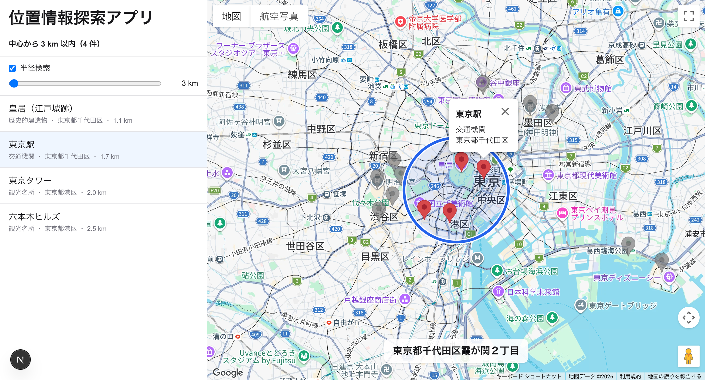

# 位置情報探索アプリ

<p align="center">
  
</p>

<p align="center">
  
  
  
  
  
  
  
  
  
  
  
</p>

## 環境構築

`cp .env.example .env` を実行して、Google Maps API キーを設定してください。

## 実行手順

1. 以下のコマンドを実行すると、DB・API・フロントエンドがすべて起動します

   ```bash
   docker compose up -d --build
   ```

2. http://localhost:3000/ にアクセスして、フロントエンドを確認してください。<br/>
   地図上のマーカーまたはリスト表示の項目をクリックすると、そのスポットの詳細情報を吹き出しで表示します。

3. 範囲を絞り込んで検索する場合は、サイドバーにある「半径検索」を有効にしてください。<br/>
   スライダーを操作するか、地図上で範囲の枠をドラッグすると領域を変更できます。

## 使用した主要ライブラリとその選定理由

### フロントエンド

| ライブラリ                             | 選定理由                               |
| -------------------------------------- | -------------------------------------- |
| `openapi-fetch` / `openapi-typescript` | APIを型安全に管理するために採用        |
| Vitest                                 | 高速なユニットテストが行えるように採用 |

### バックエンド

| ライブラリ        | 選定理由                                                     |
| ----------------- | ------------------------------------------------------------ |
| `@nestjs/swagger` | Swagger UI でAPIドキュメントを表示できるようにするために採用 |
| Vitest            | 高速なユニットテストが行えるように採用                       |

### データベース

| 名前                 | 選定理由                                                         |
| -------------------- | ---------------------------------------------------------------- |
| PostgreSQL + PostGIS | 距離での絞り込み検索が、用意されている関数で手軽に行えるため採用 |

### その他

| 名前                       | 選定理由                                                             |
| -------------------------- | -------------------------------------------------------------------- |
| GitHub Actions             | ESLint / Vitest / ビルドの自動実行で、コード品質を担保するために採用 |
| Google Maps JavaScript API | Webページ上での地図表示に使用                                        |
| Google Geocoding API       | リバースジオコーディングで座標から住所を取得する際に使用             |

## 実装時に特に工夫した点、および技術的な判断を行った箇所

### 特に工夫した点

- **より直感的な範囲検索**<br/>
  地図上に表示された円形の枠をドラッグすることでも範囲を変更できるようにしました。<br/>
  また、範囲に含まれるスポットのマーカーとそれ以外とで色を変えることで、視認性を向上させました。
- **検索の高度化**<br/>
  「座標のわずかな移動ではAPIを叩かない」は歓迎要件にありましたが、Google Maps API はリクエスト数によっては課金対象になってしまうため、機能要件として優先度を上げて実装しました。<br/>
  高速に地図を移動した場合でも、スロットル処理で最短1秒間隔でリクエストを送るように間引くことで、リクエスト数を抑えつつ、ユーザーの操作に対してもある程度のレスポンスを返せるようにしました。<br/>
  なお、時間ではなく距離による判定については、実際には住所が変わる場面でも弾かれてしまう可能性を考慮して、今回は実装を見送りました。

#### 技術的な判断箇所

- **PostGIS の採用**<br/>
  `ST_Distance` が使えるようになるので距離計算を DB 側で行えるようになり、開発工数削減・パフォーマンス向上が見込めるため採用しました。
- **OpenAPI で自動生成された型の利用**<br/>
  型安全にすることでコンパイル時にエラーで検知できるように ＆ 型の二重管理を防ぐために、フロント側では直書きしないようにしました。
- **ユニットテストの実装**<br/>
  自前で書くロジック部分のみ、ユニットテストを実装しました。<br/>
  PR作成時・PRコミット時に自動でテストが走るように GitHub Actions を設定し、デグレードを防ぐようにしました。
- **Agent Skills の導入**<br/>
  少ないトークン量でより高精度に実装できるようにするために、各種スキルを導入しました。
  - Docker<br/>
    公式が提供しているものを使用<br/>
    https://docs.docker.com/ai/skills/install/#claude-code
  - pg-aiguide<br/>
    PostgreSQL 用のSkills。プラグインを導入すれば PostGIS にも対応。スターが多く、更新頻度も高いのでこれを採用。<br/>
    https://github.com/timescale/pg-aiguide
  - antfu/skills<br/>
    Vitest 用に、スターが多く更新頻度が高いこちらを採用。<br/>
    https://github.com/antfu/skills

## 時間が足りず実装を簡略化した箇所や、今後の改善点

- 今はフロント側へのスロットル処理のみに留めていてAPI単体の大量コールには対応できていないため、API側にもスロットル処理を入れたり最大コール制限を設けたりすることで、よりリクエストに対して厳格に制御できるようにする。<br/>
  （不正アクセスがあった場合でも、影響を最小限に抑えられるようにするための取り組み）
- 今はテストはユニットテストのみ実装しているので、今後のプロダクト展開を踏まえてインテグレーションテストやE2Eテストも実装することで、より堅牢なアプリケーションにしてデグレを防ぐ。

## 補足事項

- その他のURL
  - API: http://localhost:3001/
  - Swagger UI: http://localhost:3001/docs
- 実際のプロジェクトを想定して、タスクは GitHub Projects で管理し、PRベースで開発しました<br/>
  https://github.com/users/RabbitProgram/projects/6
- [公式利用規約](https://cloud.google.com/maps-platform/terms/maps-service-terms) の 6.3.2 によると、リバースジオコーディングの住所をバックエンド側でキャッシュして使い回すことは禁止されていたため、キャッシュ実装は見送りました
